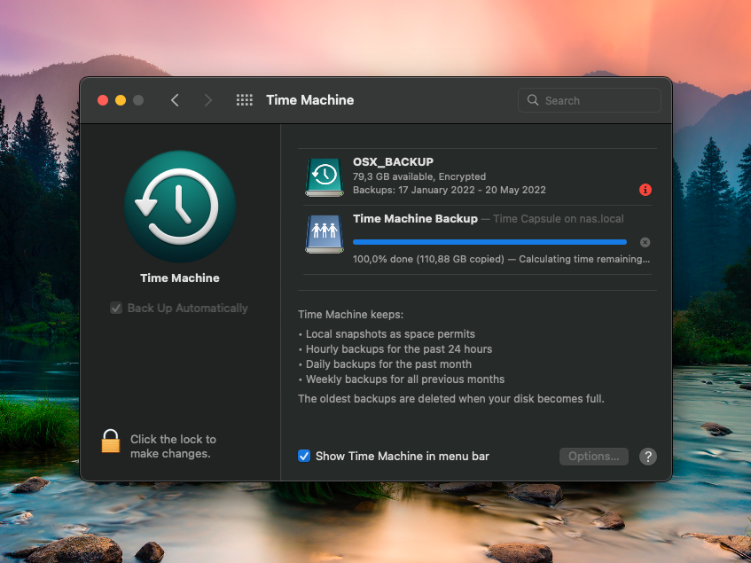

# Time Machine Backup (for now, unencrypted only)

[](./img/image1.png)

## Initial repos / articles

* https://github.com/dperson/samba
* https://github.com/solidnerd/docker-avahi
* https://alexlubbock.com/time-machine-network-backup-linux

## Makefile

* `make all`
* `make all-local`
* `make build`
* `make run`
* `make run-local`
* `make stop`
* `make stop-local`
* `make logs`
* `make logs-local`

## Local sufix

It's for building images from scratch.

## For ZFS users

While I'm using ZFS, I've setuped ZFS quota on dataset to limit space.

https://docs.oracle.com/cd/E23823_01/html/819-5461/gazvb.html

## Speed up initial backup

```bash
sudo sysctl debug.lowpri_throttle_enabled=0
```

## ENDUSER INFO

Please modify everything if needed.

## Important info about naming

```yaml
# docker-compose.yml:30-32
  (...)
   volumes:
     - /XYZ:/backup:z
   command: '-s "Time Machine Backup;/backup;yes;no" -u "backup;backup" -p'
```

```xml
<!-- avahi/services/smb.service:5-9 -->
  (...)
  <service>
    <type>_adisk._tcp</type>
    <txt-record>sys=waMa=0,adVF=0x100</txt-record>
    <txt-record>dk0=adVN=Time Machine Backup,adVF=0x82</txt-record>
  </service>
```

As You can see both names have to be the same - `Time Machine Backup` - for Avahi to work.
